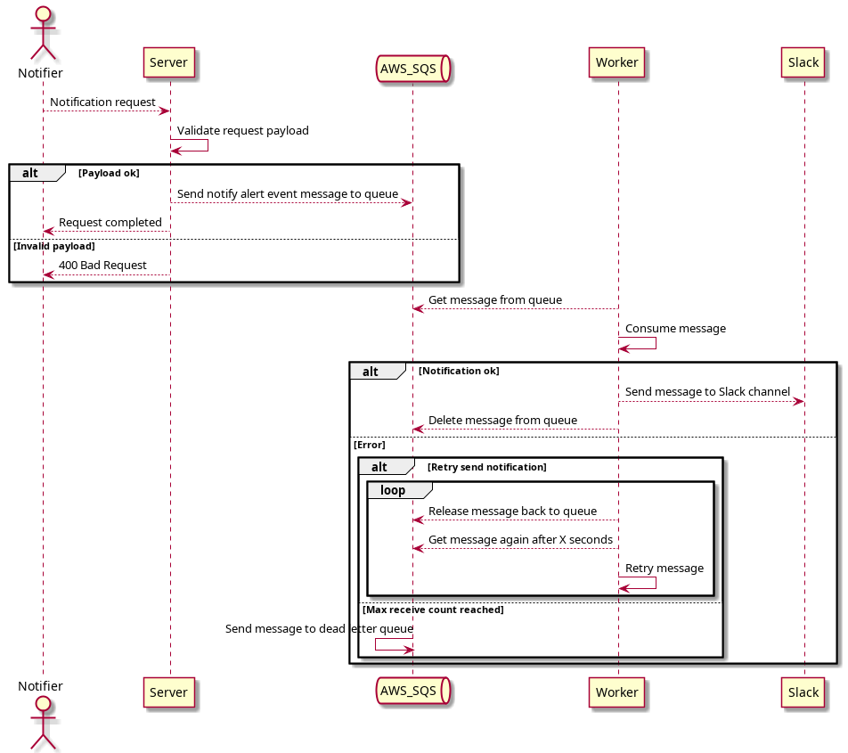

<p align="center">

</p>

# iFood Assessment Challenge

## Description

As we receive security alerts from different systems and, and it's not viable checking incidents manually, **we need an automated way to receive them** in *Slack* and **ensure that no alert will be lost due to the unavailability of some component.**
Therefore, your objective in this challenge will be to **develop a system that receives alerts and notifies them in different channels in *Slack***, guaranteeing the delivery of messages through an *AWS SQS* queue.

Your system **must have the following components**:
- A server that receives JSON events through its API and sends them to an AWS SQS queue. These events must at least contain the message and the *Slack* channel where that message will be posted.
- An AWS SQS queue.
- A worker that consumes these messages from the queue and post them to the *Slack* channel.

### Project requirements

- The server must be implemented in Go and the worker in Python.
- The server, worker and AWS environment must be dockerized.
- Documentation and testing.

## How alert notification works
  
This diagram ilustrates the notify alert sequence flow.
  


## Usage

### Create and configure a *Slack App* to send messages

You need a *Slack App* to be able to send messages to a channel. You can create an app following [this tutorial](https://slack.com/help/articles/115005265703-Create-a-bot-for-your-workspace).
After creating an app, you need to set some configurations to be able to interact with a channel:

- Click the app and select `OAuth & Permissions` tab in the left sidebar.
- Scroll down to `Scopes`. To send messages to a channel you need to add the `chat:write` Oauth Scope.
- Grab your Oauth Token in `OAuth Tokens for Your Workspace`.
- Invite your app to a channel using `/invite @AppName`.

### Set yout OAuth Token

Now that you have your `App Oauth Token`, go to `workers/slack-notifier/conf/default.env` file and paste it in the `SLACK_OUATH_TOKEN` variable.

```
SLACK_OUATH_TOKEN=xox-testestestestsetetstes123
```

### Starting the system

You have these alternatives to start the system:

``` bash
# Runs using base image
$ docker-compose up

# Runs in a development environment, enabling auto reload
$ docker-compose -f .docker/dev-compose.yaml up

```

### Sending an alert notification

To send an alert notification to a Slack channel through this system, send a **POST** request to `http://localhost:3000/v1/events/notify_alert` endpoint, following the payload specified below. 

The attachments field is optional. More info about build attachments can be found [here](https://api.slack.com/messaging/composing/layouts#building-attachments).

``` JSON
{
    "channel": "my-notification-channel",
    "messsage": "Hi from notification server",
    "attachments": [
      {
          "text": "Attachment text",
          "fallback": "Fallback text"
      }
    ]
}
```

Example
``` bash
# Using curl
curl --header "Content-Type: application/json" \
  --request POST \
  --data '{"channel":"my-notification-channel","message":"This is a message"}' \
  http://localhost:3000/v1/events/notify_alert
```

## Useful links

- [PlantUML](https://plantuml.com/)
- [AWS SDK for Go](https://aws.github.io/aws-sdk-go-v2/docs/getting-started/)
- [AWS SDK for Python](https://boto3.amazonaws.com/v1/documentation/api/latest/index.html)
- [Boto3 Guide](https://boto3.amazonaws.com/v1/documentation/api/1.21.30/guide/sqs-examples.html)
- [Slack Apps Portal](https://api.slack.com/apps)
- [Slack SDK for Python](https://pypi.org/project/slack-sdk/#sending-a-message-to-slack)
- [Slack Docs](https://api.slack.com/#read_the_docs)